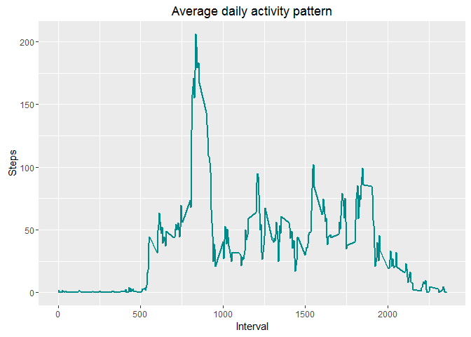
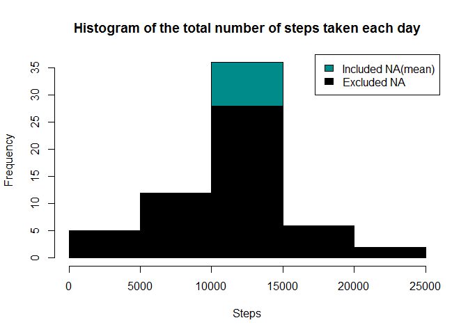
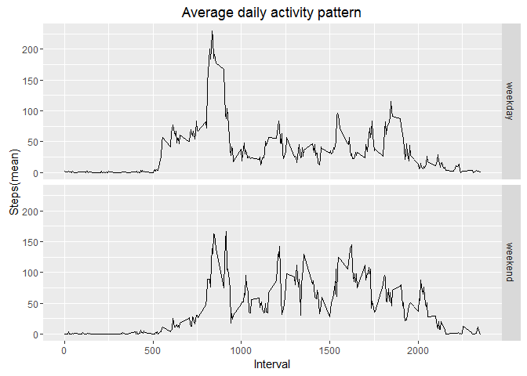

# Reproducible Research: Peer Assessment 1
Leszek Felczak  
April 8, 2017  


## Loading and preprocessing the data
Code for reading in the dataset and/or processing the data


```r
fileURL <- "https://d396qusza40orc.cloudfront.net/repdata%2Fdata%2Factivity.zip"
download.file(fileURL, "RRProjectDataSet.zip")
unzip("RRProjectDataSet.zip")
rawData <- read.csv("activity.csv")
rawData$date <- as.Date(rawData$date)
```

Data sample:

```r
head(rawData)
```

```
##   steps       date interval
## 1    NA 2012-10-01        0
## 2    NA 2012-10-01        5
## 3    NA 2012-10-01       10
## 4    NA 2012-10-01       15
## 5    NA 2012-10-01       20
## 6    NA 2012-10-01       25
```

```r
str(rawData)
```

```
## 'data.frame':	17568 obs. of  3 variables:
##  $ steps   : int  NA NA NA NA NA NA NA NA NA NA ...
##  $ date    : Date, format: "2012-10-01" "2012-10-01" ...
##  $ interval: int  0 5 10 15 20 25 30 35 40 45 ...
```

## What is mean total number of steps taken per day?
Histogram of the total number of steps taken each day

```r
rawDataSum <- with(rawData,aggregate(steps ~ date, FUN=sum))
hist(rawDataSum$steps, xlab="Steps", main = "Histogram of the total number of steps taken each day")
```

<!-- -->

```r
rawDataMean <- as.integer(mean(rawDataSum$steps))
rawDataMedian <- as.integer(median(rawDataSum$steps))
```
Mean number of steps taken each day is 10766.

Median number of steps taken each day is 10765. 

## What is the average daily activity pattern?
Time series plot of the average number of steps taken


```r
rawDataNoNa <- rawData[!is.na(rawData$steps),]
rawDataMeanByInterval <- with(rawDataNoNa,aggregate(steps ~ interval, FUN=mean))

library(ggplot2)
plotMeanByInterval <- ggplot(rawDataMeanByInterval, aes(x = interval,y = steps))
plotMeanByInterval + geom_line(colour = "cyan4", size = 1) + labs(x = "Interval", y = "Steps",  title = "Average daily activity pattern")
```

<!-- -->


```r
vMaxSteps <- max(rawDataMeanByInterval$steps)
vMaxInterval <- rawDataMeanByInterval[rawDataMeanByInterval$steps == vMaxSteps,"interval"]
```
835 is a 5 minute interval which contains the maximum number of steps (on average).

## Imputing missing values
Code to describe and show a strategy for imputing missing data


```r
rawDataNaSum <- as.integer(sum(is.na(rawData)))
```
Total number of missing values (NA) in dataset is 2304.

Filling in the missing data with the mean for that 5-minute interval (strategy).
Created a new dataset that is equal to the original dataset but with the missing data filled in.


```r
library(dplyr)
```

```
## 
## Attaching package: 'dplyr'
```

```
## The following objects are masked from 'package:stats':
## 
##     filter, lag
```

```
## The following objects are masked from 'package:base':
## 
##     intersect, setdiff, setequal, union
```

```r
rawDataNa <- rawData[is.na(rawData$steps),]
rawDataNaWithMean <- merge(rawDataNa,rawDataMeanByInterval, by = "interval")
rawDataNaWithMean <- rawDataNaWithMean[,c(4,3,1)]
names(rawDataNaWithMean) <- c("steps","date","interval")
rawDataNaWithMean$steps <- round(rawDataNaWithMean$steps)
rawDataFinal <- rbind(rawDataNoNa,rawDataNaWithMean)
rawDataFinal <- arrange(rawDataFinal,date, interval)
```

Sample data:

```r
str(rawDataFinal)
```

```
## 'data.frame':	17568 obs. of  3 variables:
##  $ steps   : num  2 0 0 0 0 2 1 1 0 1 ...
##  $ date    : Date, format: "2012-10-01" "2012-10-01" ...
##  $ interval: int  0 5 10 15 20 25 30 35 40 45 ...
```

```r
head(rawDataFinal)
```

```
##   steps       date interval
## 1     2 2012-10-01        0
## 2     0 2012-10-01        5
## 3     0 2012-10-01       10
## 4     0 2012-10-01       15
## 5     0 2012-10-01       20
## 6     2 2012-10-01       25
```

Make a histogram of the total number of steps taken each day and Calculate and report the mean and median total number of steps taken per day.


```r
rawDataFinalSum <- with(rawDataFinal,aggregate(steps ~ date, FUN=sum))
hist(rawDataFinalSum$steps, xlab="Steps", main = "Histogram of the total number of steps taken each day", col = "cyan4")
hist(rawDataSum$steps, xlab="Steps", col = "black", add=TRUE)
legend("topright", c("Included NA(mean)", "Excluded NA"), fill=c("cyan4", "black") )
```

<!-- -->


```r
rawDataFinalMean <- as.integer(mean(rawDataFinalSum$steps))
rawDataFinalMedian <- as.integer(median(rawDataFinalSum$steps))
```

Mean number of steps taken each day (including NA values replaced with the mean value per interval): 10765 (without NA's: 10766).

Median number of steps taken each day (including NA values replaced with the mean value per interval): 10762 (without NA's: 10765).

The difference is very small and there is minor impact on data.

## Are there differences in activity patterns between weekdays and weekends?

Panel plot comparing the average number of steps taken per 5-minute interval across weekdays and weekends

```r
rawDataFinal$day.type <- as.factor(ifelse(weekdays(rawDataFinal$date) %in% c("Saturday","Sunday"),"weekend","weekday"))
rawDataFinalMeanByIntervalDayType <- with(rawDataFinal,aggregate(steps ~ interval+day.type, FUN=mean))
plotFinalMeanByInterval <- ggplot(rawDataFinalMeanByIntervalDayType, aes(x = interval,y = steps))
plotFinalMeanByInterval + geom_line(colour = "black") + labs(x = "Interval", y = "Steps(mean)",  title = "Average daily activity pattern") + facet_grid(day.type ~.)
```

<!-- -->

Yes, there are two main differencies:

1. Activity pattern is higher in the morning in the weekdays (go to work/school?)

2. General activity is higher in the weekends (more walks/fitness/trainings and less sitting in the work/school)
